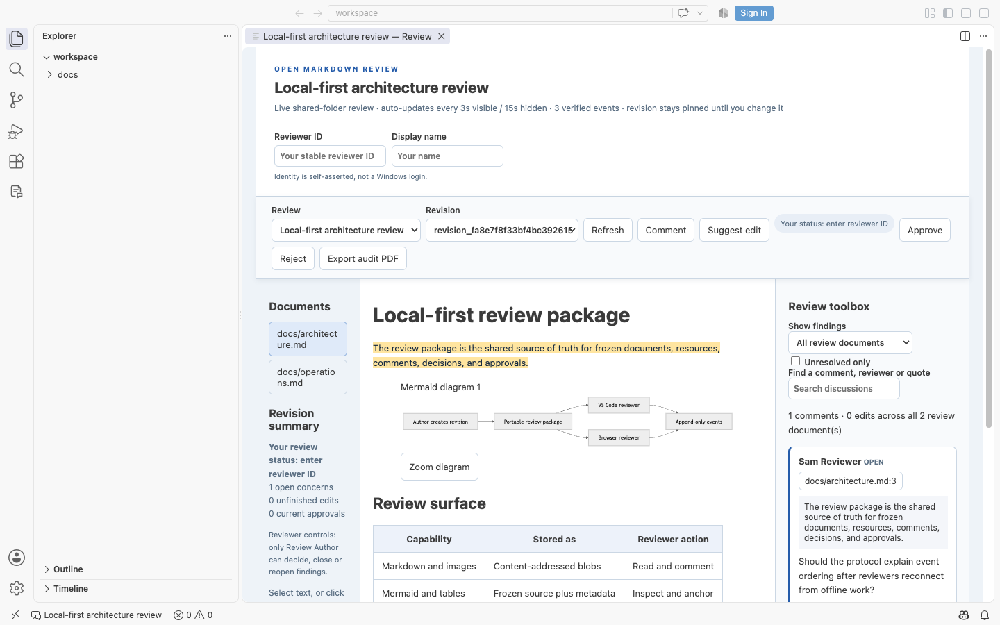
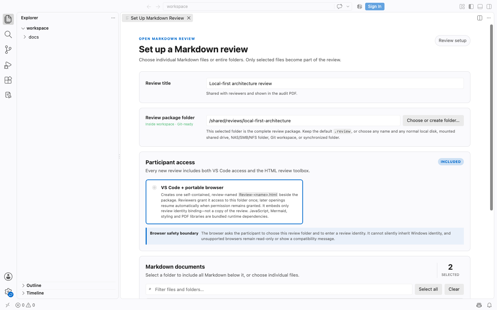
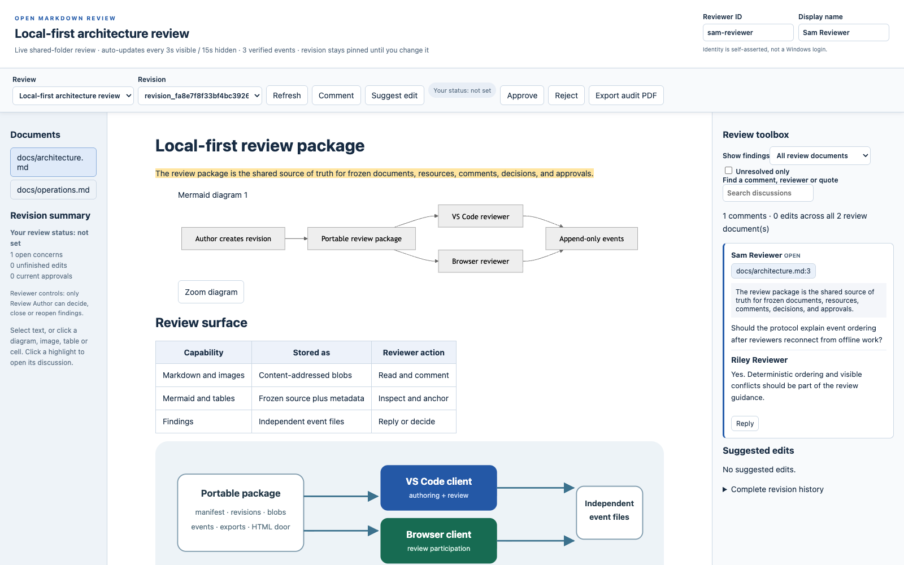

# Open Markdown Review 0.5.4

Review Markdown collaboratively without a review server. Authors work in VS Code; participants can use the same review package in VS Code or through its double-clicked HTML launcher in a supported Chrome or Edge browser. Documents, replies, decisions, approvals, and audit evidence remain files in one local-first package.



There is no application server, browser extension, cloud account, or separate review database. A package can live on ordinary disk, Git, a mounted network folder, or a folder synchronized by the participants' chosen storage provider.

Version **0.5.4 is a regular release with known limitations**, not a qualified professional pilot. It improves distribution and Marketplace presentation without changing the review protocol or the 0.5.3 review behavior. Markdown and optional Slidev review retain framework-neutral core wire version 0.5.0. Read the [0.5.4 release notes and limitations](docs/releases/0.5.4.md); existing 0.4 packages keep their legacy VS Code reader and are never silently migrated.

## Install

### Visual Studio Code Marketplace

Open **Extensions** in VS Code, search for **Open Markdown Review**, and select **Install**. You can also use:

```sh
code --install-extension mirdadusi.open-markdown-review
```

The listing is published under publisher ID `mirdadusi`. Source, release artifacts, and issue tracking remain in the [public upstream repository](https://github.com/mirdadusi/open-markdown-review).

### Manual or offline installation

Download the VSIX and matching SHA-256 checksum from the [0.5.4 GitHub release](https://github.com/mirdadusi/open-markdown-review/releases/tag/v0.5.4). For Windows x64 use `open-markdown-review-0.5.4-win32-x64.vsix`; for other supported VS Code platforms use `open-markdown-review-0.5.4-portable.vsix`. Run **Extensions: Install from VSIX** in VS Code and reload when prompted.

Browser-only participants do not install the extension. They receive the complete review folder and double-click its review-named HTML launcher.

## One package, two participant experiences

| Create and configure in VS Code | Participate in supported Chrome or Edge |
| --- | --- |
|  |  |

- Create a review from selected Markdown files or folders and place it directly in its final storage location.
- Review GFM Markdown, Mermaid diagrams, local or captured external images, structural HTML, tables, and optional Slidev presentations.
- Add anchored comments and suggested edits, reply to findings, and follow initiator-managed decisions and resolution.
- See events arriving through shared or synchronized storage without merging a shared database file.
- Approve or reject an immutable revision and export an offline PDF review archive with comments, responses, findings, and evidence.
- Keep the generated HTML launcher as a client door only; the manifest, revisions, blobs, and independent event files remain the single source of truth.

## Tested status and known limits

The release source passed its recorded unit/protocol, real-browser, VS Code extension-host, dependency-audit, and packaging checks on its supported release platforms. Passing automation is not complete browser, transport, security, or usability qualification.

- **SMB remains untested**, because no authorized test share was available. No SMB compatibility or performance claim is made.
- Remaining professional-pilot requirements are tracked in the [implementation status](spec/IMPLEMENTATION-STATUS.md).
- Identities are self-asserted and events are unsigned. Exact-byte audit hashes do not authenticate a reviewer or prove that every disconnected participant has synchronized.

## Open a review someone sent you

1. Open its folder in Explorer/Finder.
2. Double-click the review-named launcher, for example **Review-Architecture.html**, in a supported Chrome/Edge browser.
3. On first use, choose that same review folder when the browser asks for access. Later openings reconnect automatically when the browser still grants access; otherwise click **Resume** once.
4. Enter a stable reviewer ID and your name. Select the pinned revision if there are competing heads.
5. Select text or click a diagram, image, table, or cell, then choose **Comment** or **Suggest edit**.

The first folder grant is a browser security requirement. An HTML file cannot silently obtain access to its neighboring files or inherit a verified Windows login. The launcher is bound to the expected review ID and exact manifest digest, so choosing a different folder is refused. Remembered access is best effort and may require one-click reconnection. Unsupported/restricted browsers show an explicit explanation; they do not simulate saving.

With the extension installed, opening **the same Review-&lt;name&gt;.html file in VS Code** opens the review custom editor. **Markdown Review: Connect Existing Review** also accepts a package folder. VS Code uses its installed trusted toolbox, not arbitrary JavaScript found in a received package.

## What is implemented

- One shared validation, session, renderer, action toolbox, and PDF exporter in both hosts.
- Markdown, GFM and sanitized structural HTML tables/cells, Mermaid, frozen local/data/HTTPS images (including raw ``), explicit attachments, and audited external links.
- Anchored comments, replies, visible highlights, click-through navigation, and searchable/paged discussion history. The discussion side panel defaults to every review document and can be narrowed to the selected Markdown document.
- Separate initiator accept/reject decisions and resolve/reopen status. Accepting a concern does not resolve it.
- Exact-string insertion, replacement and strikeout suggestions; accept/reject and explicit author-only source application.
- Revision approval, rejection and withdrawal with freshly verified evidence and confirmation of the observed state.
- Multiple packages and explicit immutable revision selection; arriving revisions never silently retarget a draft.
- Independent content-addressed event files, conflict detection, partial-write recovery, and eventual synchronization.
- Whole-revision offline review archives containing a challenge register, every frozen document with its challenge map, a dedicated comments/responses/findings section, participant stance history, diagrams, tables, suggestions, and the exact audit appendix. Finding links connect challenged locations to their full history; UI filters never shrink an audit export.
- CLI creation/revision/export/inspection/validation and safe HTML installation/update.

Graphical creation is in VS Code; the same authoring service is available from the CLI. A participant browser does not need the source workspace.

### Structural HTML in Markdown

New reviews declare the optional `sanitized-html-v1` capability and use `commonmark-gfm+sanitized-html-v1`. This supports document-converter HTML such as tables (including merged cells), headings, paragraphs, lists, formatting, bookmarks, links, details and images in both the VS Code toolbox and the generated browser client. Raw HTML images are captured into the review package, raw tables/cells can be commented like Markdown tables, visible HTML text retains exact source mapping, and the same sanitized structure is used for audited PDF export.

This is intentionally not arbitrary webpage support. Scripts, styles, event handlers, forms, frames, embedded/media objects, raw SVG/MathML and non-allowlisted attributes cannot execute; unsupported tags are shown as inert literal text. Source HTML comments remain in the exact frozen Markdown but are omitted from the rendered review. Only frozen images are displayed, and only `https`/`mailto` external links are actionable. See the [normative sanitized HTML profile](protocol/profiles/sanitized-html-v1.md) for the exact element/attribute/reference rules.

Existing 0.5 packages without that immutable capability remain compatible and continue to display raw HTML literally. A received package that requires the profile must be opened with a client that implements it; an older client must not write or approve against a different rendering.

## Create in VS Code

Open a Markdown source workspace, select the Review icon in the left Activity Bar, and choose **Create New Review**. The visual setup selects individual documents or folders, the start document, title and storage folder/name. Additional prompts allow an approval quorum and explicitly granted external-resource folders.

The selected storage folder may already be the final empty OneDrive/synchronized/shared-drive directory; no intermediate local package is required. Creation stages captured bytes privately, then publishes the manifest, frozen Markdown/resources, revision, first event and review-bound HTML launcher into that folder. A Markdown scope has one explicit source root. In a multi-root VS Code workspace, creation asks which root to use; additional resource roots can supply images and attachments but do not add Markdown documents.

To place an existing review in a shared location, right-click its entry and choose **Publish Verified Review Copy…**. Select an empty destination and stop all other writers while it runs. The extension rejects links and foreign top-level content, copies the complete package, hashes and re-reads every file, fully validates the destination, rechecks the source inventory, then switches the active connection to the destination. The old package is not deleted; it is disconnected and must not be used as a second active review history.

Use **Link Local Source Workspace…** when a received, moved, or reconnected review should create later revisions or apply accepted suggestions to editable source. The extension privately checks every current reviewed path and reports exact, changed, or missing files. Changed files are expected when preparing a new revision; missing files prevent the link. The absolute source location stays in local VS Code state and is never written into the review package.

## Remove or delete a review in VS Code

Right-click a review in the **Reviews** list, or use the matching **Markdown Review** command from the Command Palette:

- **Remove Review from List** disconnects it locally. Shared files remain unchanged; use **Connect Existing Review** to add it again. This also works when its folder is unavailable.
- **Delete Review…** checks the folder and asks before moving the **entire review package** to OS Trash/Recycle Bin, including comments, replies, revisions, frozen content, exports and HTML. The confirmation shows the exact folder and file count. Original source files outside that package are untouched.

Both actions close that review's toolbox tabs and discard unsaved drafts after confirmation. They clear the removed review's active selection and local authoring-resume shortcuts; private recovery journals remain on disk. Other reviews stay connected. Legacy reviews are not rediscovered automatically after removal; reconnect explicitly.

Deletion refuses source/workspace roots, linked folders/junctions, Git metadata, unexpected top-level files and detected unfinished writes. If you opened the review package itself as the VS Code workspace, open its parent/source workspace first. Local review operations must finish before deletion, and the folder is checked again after confirmation. Inspection is bounded to 100,000 entries and 32 levels.

**Stop all other browser, VS Code and CLI writers before deleting a shared review.** Deletion can propagate to other participants through sync; these checks do not lock other machines or eliminate filesystem races. On a share without Trash/Recycle Bin support, the operation reports failure and does **not** retry with permanent deletion. Inspect the folder after any storage error. To recover a successfully trashed package, restore it using the OS and reconnect it. OS trash behavior on Windows/shared drives is not locally qualified; SMB testing remains skipped.

No protocol events are edited or removed individually and no `review.deleted` event is invented: whole-package deletion is filesystem lifecycle, outside the append-only review history. In Git, inspect and commit the resulting deletions yourself; the extension never commits or pushes them.

## Slidev presentations

Choose **Slidev presentation** during creation to capture the root deck and its local `src:` imports with the installed, explicitly trusted Slidev 52.19.1 runtime. Select whether speaker notes are included or removed. Browser participants need no Slidev installation: they get slide navigation, frozen themed images, whole-slide comments, exact source-text comments/suggestions, replies, decisions and audited PDFs in the same toolbox as VS Code.

This uses three layers: the unchanged core protocol, a separately versioned Slidev profile, and a shared client adapter. All source, profile data and frozen slides remain in the one review package. The HTML file remains a generic door/toolbox, not a second deck or discussion store.

Static previews preserve Mermaid, tables, images and rendered theme/component styling. Interactive behavior, animations, video, custom preparsers/addons and pixel-region anchors are outside v1. Authors must inspect captures; excluded notes are not a general secret-removal guarantee. Ordinary Markdown clients must understand the optional profile to participate; old clients fail closed.

See the [Slidev creation/review guide](docs/SLIDEV.md), [profile specification](spec/SLIDEV-PROFILE-V1.md), [transport rules](protocol/profiles/README.md) and [example deck](examples/slidev/slides.md). Author-only runtime dependencies and their narrow, isolated test-fixture advisory exceptions are documented there; they are not shipped to reviewers.

Creation captures saved disk bytes. Unsaved editors require an explicit save/use-disk choice. Every successful creation installs the HTML entry file with JavaScript, Mermaid, fonts and PDF runtime bundled; reviewers need no CDN or npm installation.

Creation can be cancelled before final publication. Its private capture checkpoints remain intact; run Create again to choose a saved operation to resume. Once final publication starts, the client finishes and reports the actual result.

To update documents, choose **Choose Documents and Create Revision**. Existing review evidence stays immutable. Parents are selected explicitly; a merge revision does not transfer earlier comments or approvals to new content.

### Reviewer identity and active review

Version 0.5.4 uses one **Reviews** list for current and legacy packages. Creating/opening a review or focusing its toolbox selects it in **Active Review** and the status bar. The selection remains when the toolbox is closed and is restored in the same workspace; sidebar actions reopen the toolbox when needed.

The identity entered during creation prefills the VS Code toolbox. Later ID/name edits are remembered privately per review in the local VS Code profile. A fresh participant never inherits the creator identity from the shared manifest, HTML or received workspace settings. Browser participants continue choosing their own identity.

## One source of truth

```text
any-review-folder/
  manifest.json
  revisions/<revision-id>.json
  blobs/sha256/<first-two>/<digest>
  events/<exact-event-byte-digest>.json
  exports/<pdf-digest>.pdf
  exports/<inventory-digest>.inventory.json
  Review-<portable-review-name>.html
  .gitattributes
```

The editable source is used only for creating revisions and explicitly applying accepted edits. Frozen blobs are the material being reviewed; events are the review history. Both clients read that same package. Identical content is stored once by digest. The HTML contains application code, licenses, and a minimal binding (`reviewId`, title, exact manifest digest)—not copies of review content, comments, identity, approvals, or a private database.

Every selected Markdown file therefore travels inside the package even when its editable original is elsewhere. A revision maps a portable source-relative path such as `architecture/system.md` to exact bytes under `blobs/sha256/…`; captured images and attachments use the same store. Reviewers never need the author's repository. Ordinary external links remain disclosed references rather than archived pages.

Caches, remembered directory handles, identities and recovery journals remain client-local. Removing a cache cannot remove published history. An unacknowledged action may need its original local journal to resume safely.

Any filesystem-safe folder name is allowed. The design accepts filesystem paths inside Git, on a normal disk, on a mounted SMB share/mapped drive, or in a synchronized folder. **SMB behavior is unqualified:** its CI testing is excluded by user decision because an authorized test share is unavailable. Use a filesystem path, such as a mapped drive or UNC path on Windows; an `smb://` URL is not a native directory path. Neither client hosts a server.

For Git, commit the complete package. The generated `.gitattributes` disables line-ending conversion, filters and encoding transformations inside the package. The extension does not automatically pull, merge or push Git.

Copying a package preserves its review ID and does not create a protocol event. Do not write to two unsynchronized copies: they are separate transports until an external provider unions their immutable files. Prefer creating directly in the final shared location or using the verified publication command.

## Synchronization and performance

The active toolbox polls after the previous scan finishes: every three seconds in the foreground, fifteen seconds in the background. This is eventual visibility after the storage provider delivers complete bytes, not a guarantee that disconnected users have synchronized.

Cold open shows a blocking progress panel immediately after folder selection. For ordinary Markdown reviews it validates the manifest, immutable events, revision descriptors and policy first, then fetches only the selected document and resources actually visible in that document. Other frozen content remains content-addressed and loads on demand. Approval, rejection, withdrawal and audited PDF export still require complete fresh verification of the whole relevant revision; progressive display never weakens those evidence checks.

Browser and VS Code participants therefore see newly admitted peer comments automatically and receive a small arrival notice; manual refresh is not required in the normal connected case. Simultaneous comments are safe because each action publishes a separate content-addressed event file. This is not a WebSocket-style real-time channel: SharePoint/OneDrive/Syncthing/Git or another folder transport can add its own delivery delay, and Git still requires an external pull/fetch workflow.

The action bar stays visible while scrolling, and selecting content opens a compact Comment/Suggest control near the viewport. Comment and suggested-edit cards link to their highlighted document positions, and clicking either kind of highlight returns to the corresponding card. New reviews declare initiator-managed finding control: reviewers can comment and reply while a thread is open, while the immutable manifest initiator can decide, close, or reopen it. Closed threads expose only Reopen to the initiator and no write controls to other reviewers; the shared core rejects stale writes until an explicit reopen. IDs remain self-asserted, so this is a consistent workflow role—not authenticated access control.

The toolbox always shows the current participant's review stance. With no active stance, Approve and Reject are available. After approving or rejecting, only Withdraw is available; withdrawing restores Approve and Reject. Every transition remains an immutable event in the audit history.

Warm scans reuse verified state and unchanged rendering. A bounded 64-event integrity sweep detects rewritten historical event files over time; explicit audits freshly verify the complete observed package. Native/browser adapters admit at most four concurrent file operations per process. An audit attempt deduplicates reads of files referenced by many earlier receipts.

Missing, partial, changed or conflicting evidence is disclosed. Approval and export fail closed. These optimizations have regression tests, including 10,000 events, but do not establish Windows latency or real SMB performance; SMB qualification is excluded and untested.

## Build, test and package

Use Node.js 22 or newer.

```sh
npm ci
npm test
npx playwright install chromium
node scripts/install-slidev-fixture.mjs
npm run test:browser
npm run test:extension
npm audit --omit=dev --audit-level=high
npm run verify:marketplace
npm run package:marketplace -- portable
npm run package:marketplace -- win32-x64
```

The VSIX files and SHA-256 checksums are created at the repository root. Install a VSIX using VS Code's **Extensions: Install from VSIX**. This does not install a browser extension. The development launch configuration also supports F5. For first publication, follow the [local Marketplace runbook](docs/MARKETPLACE-PUBLISHING.md).

The browser tests use real Chromium and real browser directory handles/IndexedDB; their deterministic adapter test uses origin-private storage and is explicitly not a native folder-permission test. Windows local-storage browser and VS Code checks run in CI. SMB testing is excluded by user decision; the retained SMB-dependent native-picker fixture has not run, so actual local native folder grants remain unqualified.

Build outputs include the generic HTML build template, CLI, extension, conservative dependency inventory and third-party notices. Creation personalizes the template's inert identity-binding meta value; executable code remains the trusted build. The HTML embeds its license notices and has a fixed-script-hash CSP, without `unsafe-eval`.

## Command line

No VS Code process is required. From a built checkout:

```sh
node dist/cli.js review create --source ./docs --store ./reviews/design --root-document architecture.md --actor-id mira --operation-id design-001 --json
node dist/cli.js review inspect --store ./reviews/design --json
node dist/cli.js review validate --store ./reviews/design --full --json
node dist/cli.js review export --store ./reviews/design --actor-id mira --operation-id export-001 --json
node dist/cli.js --help
```

Repeat `--include FILE`, `--include-dir DIR`, `--exclude PATH`, or `--resource-root PATH` as needed. `--policy FILE` accepts the policy schema. `revision create` uses the same parameters plus repeatable `--parent REVISION_ID`. Creation `--dry-run` reads local Markdown but creates no package, journal or remote capture and does not require an operation ID. Ctrl+C cancels creation before final publication with exit code 6; progress goes to stderr, leaving JSON stdout clean.

Use the original `--operation-id` with `--resume` after interrupted creation or source application. Already captured Markdown/resources and published bytes are reused. Different parameters are refused.

Accepted source edits are staged separately before replacing the source file; original bytes remain in the private recovery plan. A failed review-event publication after the source save is explicitly reported and retries only the pending evidence. Continue to use source control/backups: platform durability and external editor races are not fully qualified.

If an export fails, use Export again—even after reopening the same client—to resume its recorded operation. It does not invent another export event for that retry. Private binary recovery plans use compact base64; this is not a claim that the maximum PDF/history memory workload is qualified.

The exported PDF is an offline review archive rather than a screenshot or filtered printout. Its first-page challenge register identifies every challenged topic as `F-001`, `F-002`, and so on. Each frozen document has a challenge map, and those entries link to the dedicated comments/findings section containing the exact challenged text, comments, replies, initiator decisions, close/reopen history, suggested edits, and outcomes. A separate stance section records approval/rejection/withdrawal history. These labels and links are derived presentation aids; the review package and detached JSON inventory remain the authoritative evidence.

`client install --store PATH` adds a missing review-named HTML launcher. `client update --store PATH --expect-client-digest sha256:HEX` explicitly replaces or migrates that exact current HTML and retains a backup in `client-backups/`. In VS Code use **Update Portable Browser Client** and confirm. Do not install untrusted HTML supplied as a software update.

CLI export uses the same toolbox PDF engine through headless Chromium and requires the installed Playwright browser runtime. It does not require a server. CLI stdout is JSON; supported flags are checked per command. Exit codes follow the [CLI contract](spec/PROFESSIONAL-V1.md#10-authoring-service-and-cli-contract).

## Images, diagrams and references

```text
embedded image target: images/diagram.svg
captured attachment target: evidence.pdf; title: review:attach
ordinary external reference: https://example.org/reference
```

Embedded images and explicit attachments must be captured successfully. Bounded attachment types include PDF, plain text, JSON, registered `application/vnd.*` formats such as DOCX/Visio, and EMF originals; the review downloads rather than executes active binary attachments. Ordinary web links are described but are not archived. Parent-relative image/attachment paths work when their resolved location is inside an explicitly granted root. HTTPS capture is bounded and rejects embedded credentials/secret query parameters. Secrets already present in Markdown must be removed from source before sharing.

New reviews use the declared sanitized structural HTML profile described above; arbitrary/undeclared HTML remains inert. Mermaid uses strict configuration; embedded Mermaid configuration directives/front matter are rejected in this candidate. Invalid or unsupported required rendering blocks a complete audit PDF rather than silently omitting the item.

## Examples, protocol and assurance

Run `node scripts/create-professional-example.mjs` after building to prepare the concrete example's HTML entry file. Open the generated `examples/professional/review/Review-*.html`, not the unconnected `dist/OpenMarkdownReview.html` build template.

- [Protocol 0.5 contract](spec/PROTOCOL-0.5.md), [sanitized HTML profile](protocol/profiles/sanitized-html-v1.md), [JSON schemas](protocol/schemas/v0.5), [shared TypeScript types](src/professional/types.ts)
- [Professional requirements](spec/PROFESSIONAL-V1.md), [acceptance gates](spec/ACCEPTANCE.md), [current evidence and limitations](spec/IMPLEMENTATION-STATUS.md)
- [Security model](SECURITY.md), [legacy 0.4 documentation](docs/LEGACY-0.4.md)

Identities are self-asserted and events are unsigned. Audit hashes show exact captured bytes, not authenticated identity or global completeness. Organizational sign-off needs an additional identity/signing profile.

Project code is available under [MIT](LICENSE); the non-binding project culture is described in [M.I.R.D.A. philosophy](PHILOSOPHY.md). Third-party runtime/font/data components retain their own licenses.
