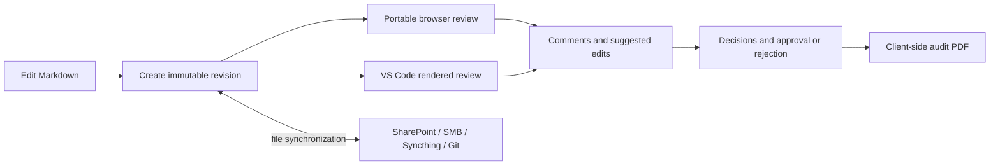
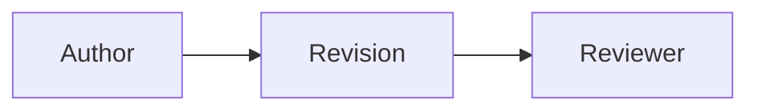

Historical documentation. For new reviews use the current README and protocol 0.5. Relative links below retain their original README context.

# Open Markdown Review 0.4

The next professional pilot is specified in [Professional review client specification](spec/PROFESSIONAL-V1.md), with a [protocol 0.5 implementation draft](spec/PROTOCOL-0.5.md) and [acceptance gates/work packages](spec/ACCEPTANCE.md). Its contract is one authoritative review package, equal reviewer capabilities in HTML and VS Code, and shared authoring through graphical setup or CLI parameters. These are target requirements; the current 0.4.6 implementation has known blockers from the 2026-09-08 review and has not passed those gates. The CLI examples in the specification are not commands implemented by this release.

Open Markdown Review is a serverless, local-first review system for technical Markdown. Each review is a self-contained folder. Its default name is `.review`, but it can be named `.architecture-review`, `safety-approval`, or anything else and stored inside the source repository or anywhere on a normal local disk, mounted SMB/NFS/NAS share, mapped network drive, Syncthing folder, removable disk, or cloud-synchronized folder. No OneDrive, SharePoint, or hosted service is required.

Client 0.4.6 is a limited-pilot client, not merely a schema demonstration. Its VS Code extension has a dedicated Review icon in the Activity Bar, manages multiple review packages per Markdown workspace, provides a visual setup flow, selective document scope, an immutable rendered review, GFM tables, Mermaid diagrams, local and external images, explicit Markdown attachments, visibly anchored threaded comments, live local-first synchronization, comment decisions, suggested edits, approval or rejection, and auditable client-side PDF export. New reviews can also include a self-contained browser participant client that opens the same package without a server or browser extension.

## What the client does

- Adds a dedicated Markdown Review icon and sidebar to VS Code.
- Creates, connects, lists, and switches between multiple independent reviews for one Markdown workspace; all actions target the visibly active review.
- Opens a visual setup panel that lists Markdown by folder with search, folder/file checkboxes, selected count, start-document choice, and review-package location.
- Stores a review in a freely named package folder inside Git or on any ordinary local/shared drive.
- Initializes a portable review without a server or database.
- Optionally installs one generic `OpenMarkdownReview.html` client beside the protocol files; it embeds application code only and reads the chosen package as the sole source of truth.
- Watches the exact active review package—even outside the workspace—and normally shows synchronized comments and replies within seconds.
- Uses filesystem notifications plus a lightweight polling fallback, serialized refreshes, and bounded retry for partially synchronized files.
- Creates an immutable revision containing only the selected Markdown documents.
- Freezes embedded local, data-URI, and HTTPS images into SHA-256-addressed blobs.
- Freezes explicitly attached Markdown links into the same blob store.
- Records ordinary external links without silently archiving entire websites.
- Renders multiple documents, GFM tables, Mermaid, frozen images, and safe Markdown in a review panel.
- Adds comments from source selections or rendered text, images, diagrams, tables, and table cells.
- Highlights commented text and annotated images, diagrams, tables, and cells in the rendered review; clicking the highlight focuses its discussion, and clicking the discussion returns to the anchored content.
- Decorates commented ranges in an open source Markdown editor with a gutter marker and hover link to the rendered discussion.
- Lists, displays replies to, navigates to, and resolves threads.
- Accepts, rejects, marks won't-fix, or marks duplicate individual comments with an auditable reason.
- Proposes exact-string insert, replace, and delete edits without silently changing Markdown; replacements and deletions are shown as strikeout/insertion diffs.
- Accepts or rejects each suggested edit and applies only accepted, conflict-free edits with before/after source hashes.
- Records approval or rejection against an exact revision.
- Exports a polished PDF containing reviewed documents, comments, replies, decisions, suggested edits, revision decisions, digests, renderer versions, and an event inventory.
- Records the PDF digest in an immutable `export.created` event.

Existing events and blobs are never modified. Concurrent participants create independently named files and reconstruct state from their union.

## Review workflow



1. Open the Markdown Review icon in the left Activity Bar and choose **Create New Review** or **Connect Existing Review**.
2. For a new review, select or create its package folder. Leave the default `<workspace>/.review` for Git storage, or choose any local or mounted shared-drive folder and any folder name.
3. Under **Participant access**, keep **VS Code + portable browser** selected when reviewers should be able to participate from a supported browser.
4. Select complete folders or individual Markdown files, choose the start document, and click **Initialize and create revision**.
5. If the workspace has several reviews, click one under **Reviews** to make it active.
6. Open **Markdown Review: Open Rendered Review**.
7. Select rendered text or click an image, Mermaid diagram, table, or cell, then choose **Comment**.
8. Click the highlighted content to focus its discussion; click the discussion location to return to the content, or choose **Open source** to select it in Markdown.
9. Select an exact string and choose **Suggest edit** to insert, replace, or delete text.
10. Reply to comments, decide them, and accept or reject suggested edits.
11. Apply an accepted suggestion explicitly if desired, then create a new immutable revision of the changed source.
12. Approve or reject the reviewed revision and choose **Export audit PDF**. Generation occurs locally inside the extension.

To change the document set later, run **Markdown Review: Review Setup and Documents**. The panel starts with the current revision selected. Saving creates a new revision with the new scope; previous revisions and their review history remain immutable.

If Markdown or an image changes, create a new revision. Source-editor comments are blocked when the active file no longer matches the frozen revision; reviewers can always use the immutable rendered view.

## Storage and Git

The selected folder is the review package itself:

```text
<any-review-folder>/
  manifest.json
  events/
  revisions/
  blobs/sha256/
  exports/
  OpenMarkdownReview.html           optional replaceable browser client
  .gitattributes
```

For a Git-backed review, keep the package inside the repository and commit the complete folder, for example `git add .review`. The generated package-local `.gitattributes` disables line-ending conversion below the package because revision and blob digests cover exact bytes. Do not ignore `events`, `revisions`, `blobs`, or audited `exports`.

For disk/shared-drive operation, select or create a folder on any filesystem visible to VS Code. A plain local directory or mounted SMB/NFS/NAS share works directly; SharePoint and OneDrive are only optional synchronization choices. The extension remembers external package locations for the current workspace. If a synchronized drive is temporarily unavailable, its registration is retained and becomes usable again after the drive returns and the view is refreshed.

### Live synchronization

With live synchronization enabled (the default), the active package is watched directly even when it is outside the opened workspace. The rendered review, sidebar, source highlights, decisions, and counters update after another participant's immutable event file reaches the local filesystem. A polling fallback runs every 3 seconds while the rendered review is visible and every 15 seconds in the background; both intervals are configurable under **Open Markdown Review › Live Sync**.

Synchronization is intentionally eventual rather than server-mediated. Local disk is usually immediate; SMB, NFS, Syncthing, OneDrive, or SharePoint adds provider/network latency. The client keeps the last validated review visible, quarantines incomplete or out-of-order files, detects the disappearance or rewrite of previously validated events during the session, retries with bounded backoff, and shows a visible **Live**, **Waiting**, or **Delayed** status. A manual **Refresh** remains available. Git-backed reviews update only after the new files are fetched/merged into the local checkout; this client does not automatically pull or push Git.

The rendered client marks newly synchronized discussions, reports new comments without stealing focus, and preserves the current document, scroll positions, focused thread, and already-rendered Mermaid diagrams while applying comment-only state updates. Existing events are never rewritten as part of synchronization.

### Local performance cache

The shared review package remains the only authoritative review record, but the extension does not use a slow network folder as its working database. It keeps the active validated event map and folded review state in memory and writes a disposable derived cache under VS Code's extension global-storage directory. The cache is never placed in the review package, source repository, or Git history.

On normal synchronization, the client performs one event-directory inventory, compares immutable filenames with the cached inventory, and reads only new or watcher-reported files. A locally published comment, reply, decision, or approval is folded into memory immediately after its exclusive shared-folder write succeeds; it does not trigger a complete package reload. Because the manifest is created once and a revision is published by its event last, polling needs only the event frontier. It does not recursively watch blobs, scan the workspace, read the manifest repeatedly, or `stat` every historical event.

Activation and sidebar synchronization validate events and the revision descriptor without eagerly downloading every frozen blob. Frozen Markdown, images, and attachments are copied into a local SHA-256-addressed content cache when the rendered review first needs them. Rendered review and PDF generation then use those verified local bytes instead of repeatedly opening SMB, NAS, OneDrive, or SharePoint-backed blobs. Later revisions verify and reuse unchanged content-addressed blobs rather than uploading duplicate temporary copies. Corrupt or incompatible cache data is ignored and rebuilt from the shared package. The cache defaults to 512 MB with least-recently-used pruning and is configurable under **Open Markdown Review › Cache: Max Size MB**; the active revision working set is protected from eviction.

Filesystem work is bounded to four concurrent operations by default to avoid overwhelming SMB servers or Windows endpoint scanners. It can be tuned under **Open Markdown Review › I/O: Max Concurrency**. Run **Markdown Review: Show Performance Diagnostics** to open timing, cache, platform, and synchronization details. Run **Markdown Review: Rebuild Local Cache** to discard the active review's derived event cache and reconstruct it with a complete shared-storage audit; authoritative review files are never changed.

Audit safety is separate from this performance path. Manual **Refresh**, review approval or rejection, and PDF export read every shared event and verify every shared revision blob before proceeding. Missing events and watcher-reported rewrites remain audit failures. Deleting the local cache loses no review information; the client reconstructs it from the shared package.

One source workspace can have several review packages—for example `.architecture-review` in Git and `safety-approval` on a shared drive. The sidebar marks one review as active. Commands never combine their event logs.

To read a review received from someone else, choose **Connect Existing Review** and select either the package folder containing `manifest.json` or a parent folder containing one or more review packages. The client discovers packages and asks which one to open when needed. If no workspace is open, the extension can open the selected package as the VS Code folder. Frozen documents, images, Mermaid, tables, comments, replies, decisions, approvals/rejections, attachments, and PDF export remain available without the sender's original source checkout. Source editing and applying suggestions naturally require the matching source workspace.

### Portable browser participation

In the current implementation, review initialization is an authoring operation in VS Code. It resolves selected source paths, captures required images and attachments, freezes exact bytes, and publishes the first revision last. The browser client deliberately cannot create or modify source revisions. The professional specification makes this one shared authoring service available through both VS Code and CLI parameters, and requires full reviewer and audited-export parity in the HTML client.

When browser access is selected, VS Code copies `OpenMarkdownReview.html` into the review-package root after the first revision succeeds. A reviewer double-clicks that file in current Microsoft Edge or Google Chrome. On first use, the browser requires the reviewer to choose that same folder and grant read/write access. The client stores only that directory handle in browser-local IndexedDB, keyed by the HTML file URL; later double-clicks open the review directly while permission remains valid, or ask for one permission confirmation if the browser revoked it. The page validates the manifest, events, revision descriptor, and every displayed blob against the checked-in JSON Schemas and SHA-256 digests. It keeps verified Markdown and resources in memory, reads only new event filenames during its three-second polling cycle, and never embeds or writes a second review database.

The browser participant renders GFM tables, frozen local or external images, Mermaid diagrams, attachments, and existing highlighted comments. It can add text/image/diagram/table comments, reply, resolve, decide, approve, and reject. Its print view includes comments and replies, but **Print / Save PDF is a convenience copy, not an audited protocol export**; use the VS Code client for the current digest-recorded `export.created` PDF workflow. Suggested-edit authoring/application and author revision creation also remain VS Code operations in this version.

No Windows identity is silently inherited. Folder ACLs decide who may reach the package, while the event actor remains self-asserted until a future signed-identity profile exists. The browser must expose the File System Access API for a directly opened local file; Firefox and Safari are therefore not participant clients for this pilot. On Windows, an SMB location must be mounted or reachable in the native folder picker rather than entered as an `smb://` URL.

To add the client to an existing active review, run **Markdown Review: Add Portable Browser Client**. The command refuses to overwrite an existing file. The HTML file is replaceable client software outside the protocol directories; deleting or replacing it does not alter any review evidence.

## Images, Mermaid, tables, and attachments

Embedded images use ordinary Markdown:

```markdown


```

Both are captured into `<review-package>/blobs/sha256/` before the revision is published. Revision creation fails closed if a required image is missing, too large, insecure, or invalid.

Mermaid uses normal fenced blocks and is rendered locally with a pinned engine version:

````markdown

````

GFM tables render with horizontal scrolling in the client and bounded page layout in the PDF.

Ordinary links are audit-listed but not downloaded. Add the standard Markdown title `review:attach` when the referenced bytes are evidence that must travel with the review:

```markdown
[Local evidence](evidence/decision.pdf "review:attach")
[Remote evidence](https://example.org/decision.pdf "review:attach")
```

Attached links are frozen, hashed, and opened from the local blob in the rendered client. Active HTML, script, and executable attachment media types are rejected.

## Install the packaged extension

In VS Code, run **Extensions: Install from VSIX…**. Windows x64 pilot users should select `open-markdown-review-0.4.6-win32-x64.vsix`, which contains native image/PDF processing. The `open-markdown-review-0.4.6-portable.vsix` package retains the cross-platform WASM fallback.

To build it yourself, use Node.js 22 or newer and VS Code 1.90 or newer:

```sh
npm install
npm test
npx --yes @vscode/vsce package --allow-missing-repository --no-rewrite-relative-links
```

For development, open this folder in VS Code and press `F5`. The Extension Development Host opens the complete workspace in `protocol/examples`.

## Project layout

```text
protocol/
  schemas/                    JSON Schema 2020-12 definitions
  fixtures/v0.4/              current portable-path conformance fixture
  examples/                   complete legacy compatibility fixture
  README.md                   normative protocol behavior
  IMPLEMENTER-CHECKLIST.md    implementation and test requirements
  STANDARDIZATION.md          client-neutral scope and protocol 0.5 requirements
media/                        bundled review UI
src/protocol/                 types, validation, snapshots, storage, state fold
src/browser/                  self-contained browser participant client
src/renderedView.ts           secure rendered-review webview
src/setupView.ts              visual review/document setup panel
src/reviewsView.ts            multiple-review registry and Activity Bar list
src/pdfExport.ts              local PDF and audit-event generation
src/reviewCache.ts            incremental event and verified local-content cache
src/extension.ts              commands, identity, status, and lifecycle
test/                         conformance, capture, merge, security, and PDF tests
output/pdf/                   visually verified sample audit report
```

## Verification

`npm test` currently covers:

- runtime validation and all three JSON Schemas;
- deterministic revision-scoped event folding;
- visual-scope pattern expansion, selection validation, and selective snapshot capture;
- deterministic comment/suggestion decision conflicts and out-of-order event arrival;
- out-of-order synchronization;
- resilient quote anchors;
- rendered and source-editor comment highlighting, discussion cards with replies, and bidirectional anchor navigation;
- Mermaid, image, table, link, and attachment discovery;
- local and remote content capture with secret redaction;
- fail-closed missing-image behavior;
- atomic event collision handling;
- persistent incremental event reconciliation, restart-safe cache recovery, bounded I/O, rewrite/deletion detection, and temporary shared-blob-unavailability fallback;
- custom-named package storage and isolation between multiple reviews of one workspace;
- generic self-contained browser-client packaging, bounded size, installation isolation, and overwrite refusal;
- PDF content, resource, Mermaid, comment, suggested-edit, approval/rejection, and digest generation.

The sample PDF is also rendered to PNG with Poppler and visually inspected for clipping, overlap, page numbering, diagrams, tables, and audit-layout quality.

## Pilot limits

- Actor IDs are self-asserted. The shared folder's access control is the authority for this pilot.
- Events are hashed for export but are not cryptographically signed.
- Raw HTML is disabled. Mermaid runs with strict security and a restrictive webview content-security policy.
- Embedded images and `review:attach` links are frozen; ordinary linked web pages remain external references.
- Protocol 0.4 keeps all decisions monotonic and does not edit or delete historical events. Conflicting decisions are surfaced rather than silently overwritten.
- Very large or unusually wide tables should be included in pilot test cases before broad deployment.
- Browser publication uses preflight collision checking plus exact post-write readback because the browser folder API has no atomic exclusive-create primitive. The protocol 0.5 content-addressed event layout in `STANDARDIZATION.md` must replace this pilot compromise before browser participant-writer conformance is claimed for high-assurance concurrent review.

See [PILOT.md](PILOT.md) for the test plan, [SECURITY.md](SECURITY.md) for the threat model, [protocol/README.md](protocol/README.md) for normative 0.4 rules, and [protocol/STANDARDIZATION.md](protocol/STANDARDIZATION.md) for the client-neutral standard boundary and next-version requirements.

## License

Open Markdown Review is dual-licensed. You may use it under either:

- the standard [MIT License](LICENSE); or
- [M.I.R.D.A. philosophy](PHILOSOPHY.md).

The package metadata expresses this choice as `MIT`.
