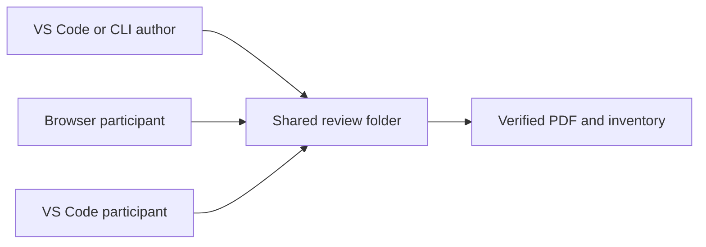

# Example architecture review

The author publishes immutable review snapshots. Reviewers write independent events.

Select the second occurrence here: local-first, local-first.

| Capability | Author | Participant |
| --- | --- | --- |
| Freeze a revision | Yes | No |
| Comment, reply, decide | Yes | Yes |
| Export audited PDF | Yes | Yes |

[Supporting evidence](evidence.txt "review:attach") is captured, not loaded from a live link during review.

[Review checklist](checklist.md) is the second document in this frozen revision.

[Protocol background](https://spec.commonmark.org/) is an ordinary external link, not archived evidence.
