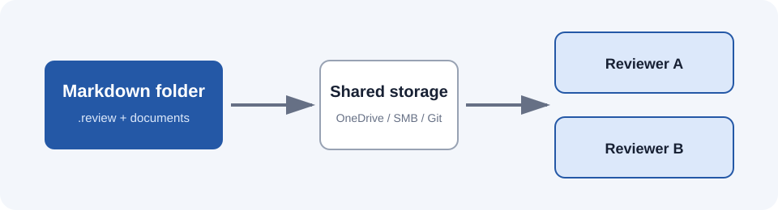

# Architecture

The orchestrator owns the global state.

Worker agents consume immutable tasks and publish their results independently.

## Processing flow

## Required capabilities

| Capability | Pilot status | Audit behavior |
| --- | --- | --- |
| Mermaid diagrams | Required | Source and rendered SVG are hashed |
| Embedded images | Required | Bytes are frozen in the blob store |
| Tables | Required | Rendered in the client and PDF |

The review also records ordinary external references such as the [CommonMark specification](https://spec.commonmark.org/0.31.2/) without downloading the linked website.
