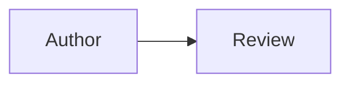

# Protocol 0.4 fixture

The runtime owns the immutable review state.

[CommonMark](https://spec.commonmark.org/0.31.2/)

```mermaid
flowchart LR
    Author --> Review
```

| Item | State |
| --- | --- |
| Protocol | Concrete |
